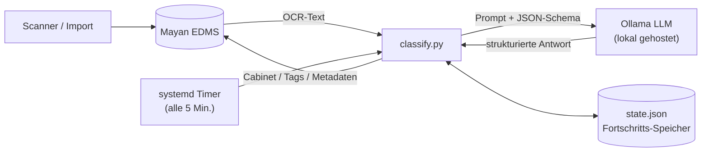

# ICE-DKMS

Automatische Verschlagwortung und Ablage neu gescannter Dokumente in einem
selbst gehosteten [Mayan EDMS](https://www.mayan-edms.com/) mittels eines
lokalen LLM (Ollama). Dieses Repo dokumentiert Architektur und
Entscheidungslogik des Systems — **kein Code, keine Zugangsdaten, keine
echten Dokumenteninhalte.**

## Ziel

Neu eingescannte Dokumente (Papierpost, Behördenschreiben, Rechnungen etc.)
landen zunächst unsortiert in Mayan. Ein Hintergrund-Job

1. liest den OCR-Text jedes neuen Dokuments,
2. bestimmt Korrespondent, Dokumenttyp, Belegdatum und passende Schlagworte,
3. sortiert das Dokument in die passende Cabinet-Struktur (virtuelle Ordner)
   ein — oder legt bei Bedarf eine neue Ablage an,
4. markiert Dokumente, bei denen sich das System unsicher ist, für manuelle
   Nachkontrolle, statt sie falsch abzulegen.

Das System verwaltet die Archive von zwei Personen parallel, mit getrennten
Cabinet-Bäumen und Kategorienlisten.

## Architektur

**Komponenten:**

| Komponente | Rolle |
|---|---|
| Mayan EDMS | Dokumentenarchiv, OCR, Cabinets (virtuelle Ordner), Tags, Metadaten |
| systemd-Timer | Stößt alle 5 Minuten einen Lauf an |
| `classify.py` | Orchestriert Regelwerk + LLM-Anfrage, ruft Mayan-API auf |
| Ollama | Lokal gehostetes LLM, liefert JSON-Schema-validierte Klassifikation |
| `state.json` | Idempotenz/Resume — welches Dokument wurde mit welchem Ergebnis bereits verarbeitet |

Ein Lockfile verhindert, dass Timer-Lauf und ein eventueller manueller Lauf
gleichzeitig schreibend auf `state.json` und die Mayan-Cabinets zugreifen.

## Weiterführende Dokumentation

- [Klassifizierungslogik](docs/classification-logic.md) — wie eine
  Cabinet-Entscheidung zustande kommt
- [Dokument-Lebenszyklus](docs/document-lifecycle.md) — Zustände von OCR-Warten
  bis Ablage, inkl. Timeout- und Recheck-Verhalten
- [Betriebs-Notizen](docs/operations.md) — gelernte Lektionen aus dem Betrieb
- [Mayan-Workflow-Machbarkeit](docs/mayan-workflow-machbarkeit.md) — könnte
  Mayan das nativ, ohne dieses externe Skript?

## Nicht-Ziele / Leitplanken

- **Nie automatisch ein bestehendes, unsicheres Ergebnis überschreiben** —
  wurde ein Dokument bereits manuell in ein Cabinet einsortiert, fasst das
  System es nicht mehr an.
- **Lieber kein Cabinet als ein falsches** — eine falsche automatische
  Cabinet-Zuordnung ist schlimmer als ein Dokument, das erstmal nur
  durchsuchbar, aber unsortiert bleibt.
- **Keine Dubletten-Cabinets** — bevor ein neues Cabinet für einen
  Korrespondenten angelegt wird, wird der gesamte bestehende Baum nach einem
  passenden Blatt durchsucht.
