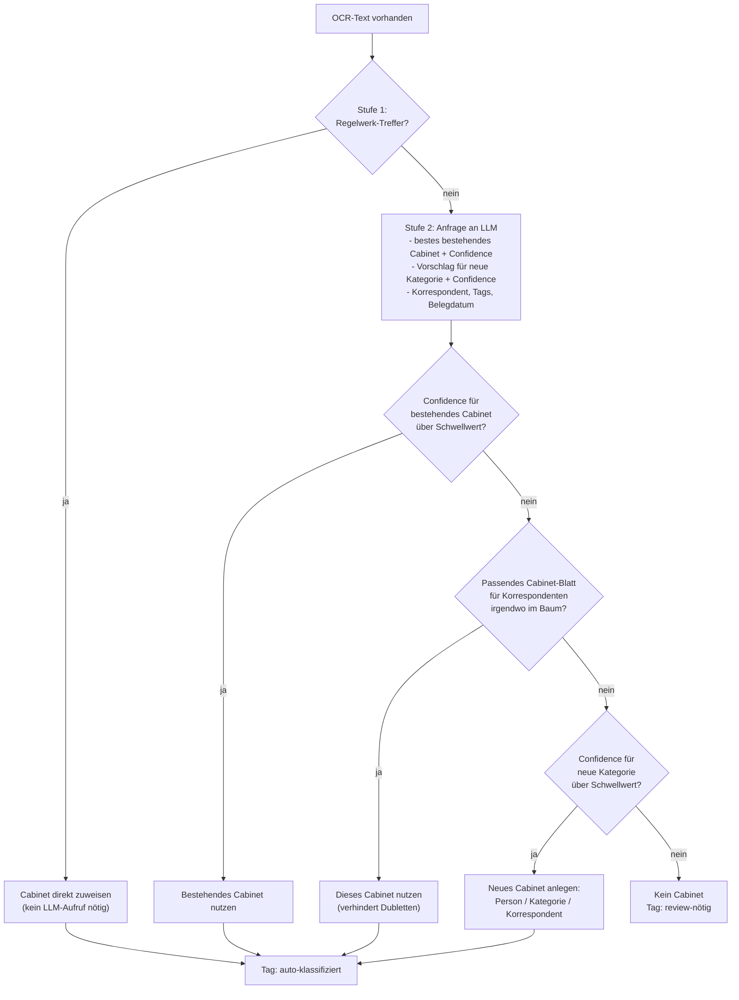

# Klassifizierungslogik

Für jedes Dokument mit vorhandenem OCR-Text wird zweistufig entschieden, wo es
abgelegt wird.

## Stufe 1 — deterministisches Regelwerk

Schnelle, hochsichere Treffer ohne LLM-Aufruf:

- **Stichwort-Regeln**: eine vom Nutzer pflegbare Tabelle
  (Stichwort → Cabinet-Pfad → optionaler Korrespondent). Ein Stichwort wird
  als einfacher, case-insensitiver Teilstring im OCR-Text gesucht.
- **Steuerjahr-Regel**: eine berechnete Namenskonvention (z. B.
  "Lohnsteuerbescheinigung für Steuerjahr 2024" → Ablage im Cabinet des
  Folgejahres), da sie kein simples Stichwort, sondern eine Ableitung ist.

Nur wenn keine Regel greift, wird die (langsamere, aber flexiblere) Stufe 2
mit dem LLM angefragt.

## Stufe 2 — LLM-Anfrage

Das LLM bekommt in einer einzigen Anfrage:

- den Titel und einen Auszug des OCR-Texts,
- die Liste aller **bereits existierenden** Cabinet-Pfade der jeweiligen
  Person (das LLM darf nur daraus wählen, nie frei erfinden),
- eine Liste erlaubter Oberkategorien für ein mögliches neues Cabinet,
- eine Liste erlaubter Tags.

Die Antwort ist über ein JSON-Schema erzwungen und enthält zwei voneinander
unabhängige Einschätzungen:

1. **„Passt eines der bestehenden Cabinets?“** — mit eigener Confidence.
2. **„Falls nicht: welche neue Oberkategorie wäre passend?“** — ebenfalls mit
   eigener Confidence, unabhängig von Punkt 1.

Erst der Code entscheidet anhand beider Confidence-Werte und eines
Schwellwerts, ob ein bestehendes Cabinet genutzt, ein neues angelegt, oder
das Dokument ohne Cabinet (aber mit Review-Tag) belassen wird. Das LLM legt
nie selbst ein Cabinet an.

### Schutz gegen Fehlklassifikation

- **Korrespondent = Dokumenteninhaber?** Extrahiert das LLM versehentlich den
  Namen des Archiv-Eigentümers selbst als „Korrespondenten" (statt der
  externen Gegenseite), wird dieser Wert verworfen, statt daraus ein Cabinet
  oder Metadatum zu machen.
- **Bestehendes Cabinet immer bevorzugt** — auch wenn das LLM eine neue
  Kategorie vorschlägt, wird zuerst geprüft, ob irgendwo im bestehenden Baum
  schon ein Cabinet für denselben Korrespondenten existiert (unabhängig von
  dessen Kategorie). Erst wenn das verneint wird, entsteht ein neues Cabinet.
- **Root-/Sammel-Cabinets sind keine gültige Wahl** — nur konkrete,
  personen- und korrespondentenspezifische Pfade sind als Ziel zulässig.
