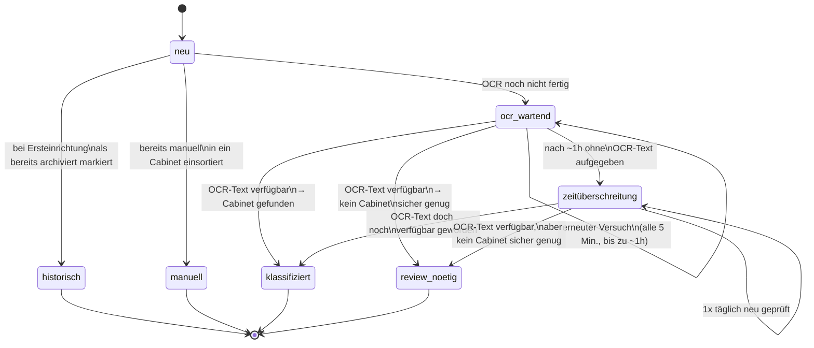

# Dokument-Lebenszyklus

Jedes Dokument durchläuft einen von mehreren möglichen Zuständen, die
persistent (idempotent/resumable) gespeichert werden. Ein bereits final
verarbeitetes Dokument wird nie wieder angefasst — außer im Timeout-Fall
(siehe unten).

## Zustände im Detail

| Zustand | Bedeutung | Tag in Mayan |
|---|---|---|
| `historisch` | Bestand bereits bei Ersteinrichtung des Systems, wird nie automatisch angefasst | — |
| `manuell` | Nutzer hat das Dokument bereits selbst in ein Cabinet einsortiert | — |
| `ocr_wartend` | Mayan hat den OCR-Text noch nicht fertig erzeugt | — |
| `klassifiziert` | Erfolgreich automatisch abgelegt | `auto-klassifiziert` |
| `review_nötig` | OCR-Text vorhanden, aber keine Cabinet-Zuordnung sicher genug | `review-nötig` |
| `zeitüberschreitung` | Nach ca. einer Stunde (12 Versuche à 5 Min.) immer noch kein OCR-Text | `ocr-fehlgeschlagen` |

## Timeout- und Recheck-Verhalten

Ursprünglich blieben Dokumente, deren OCR-Text nie fertig wurde, nach dem
Timeout dauerhaft unangetastet und **ohne jeden sichtbaren Hinweis** in
Mayan liegen — sie waren durchsuchbar, aber weder verschlagwortet noch als
"braucht Aufmerksamkeit" markiert.

Häufigste Ursache für einen dauerhaften OCR-Ausfall: Dateiformate, aus denen
Mayan keine Seitenbilder erzeugen kann (z. B. bestimmte Alt-Office-Formate,
passwortgeschützte PDFs, proprietäre Exportformate), oder Bilddokumente ohne
erkennbaren Text (leerer OCR-Inhalt).

**Verbesserung:**

1. Beim Übergang in `zeitüberschreitung` wird der Tag `ocr-fehlgeschlagen`
   gesetzt — das Dokument ist damit in Mayan gezielt filterbar und landet
   nicht mehr unauffällig im Nirgendwo.
2. Statt für immer ignoriert zu werden, wird ein Dokument im Zustand
   `zeitüberschreitung` **einmal täglich** erneut auf verfügbaren OCR-Text
   geprüft (bewusst nicht bei jedem 5-Minuten-Tick, um für dauerhaft
   defekte Formate nicht unnötig API-Last zu erzeugen). Wird der Text doch
   noch verfügbar, durchläuft das Dokument normal Stufe 1/2 der
   [Klassifizierungslogik](classification-logic.md).

Anlass für diese Änderung: ein Dokument bekam seine OCR-Seite erst nach dem
regulären ~1h-Warte-Fenster, wurde aber durch die alte Logik nie erneut
geprüft und blieb dauerhaft unklassifiziert, obwohl der Text inzwischen
längst vorlag.
