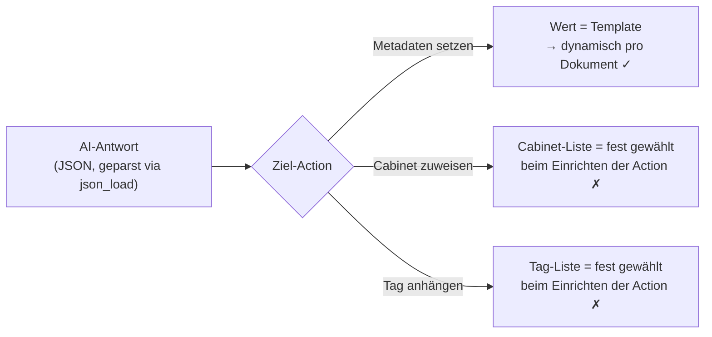

# Machbarkeit: Ollama-Klassifizierung nativ in Mayan abbilden

Ausgangsfrage: Ließe sich das, was unser externes `classify.py` tut, auch
nativ als Mayan-Workflow (ohne externes Skript) abbilden?

**Kurzfassung nach zwei Testrunden gegen die echte, laufende Instanz:**
Metadaten-Automatisierung (Korrespondent, Dokumenttyp, Belegdatum) ist
nativ **vollständig machbar** — mit echtem Test bestätigt. Cabinet-Zuordnung
und Tag-Vergabe sind es **nicht**: Die zuständigen Workflow-Actions
akzeptieren nur eine bei der Einrichtung fest ausgewählte, statische Liste
von Zielen — kein Template, kein Laufzeitwert. Das ist keine
Konfigurationsfrage, sondern ein architektonischer Fakt, verifiziert direkt
im Quellcode der tatsächlich laufenden Version. Empfehlung bleibt daher:
**beim externen Skript bleiben**, die alten Dienste werden nicht abgeschaltet.

## Praxistest 1: Grundfunktion des Ollama-Treibers

Der native Ollama-Treiber (File-Metadata-Subsystem) wurde probeweise für
einen einzelnen, wenig genutzten Dokumenttyp aktiviert und an einem
einzelnen bestehenden Dokument über den manuellen "Submit"-Endpunkt
ausgelöst (kein Massen-Reprocessing des Archivs — Verarbeitung läuft nur bei
neuem Datei-Upload oder gezieltem manuellen Trigger für ein einzelnes
Dokument).

- Erster Versuch mit `timeout: 60` schlug fehl ("timed out") — der
  Kaltstart des Modells dauerte in der Praxis ca. 62 Sekunden
  (`load_duration` in der Antwort). Mit `timeout: 240` lief es sauber durch.
- Ein statischer Test-Prompt kam korrekt zurück — Grundverbindung
  funktioniert.
- Ein Test mit **echtem OCR-Text des Dokuments im Prompt**
  (`{{ document_file.document.version_active.pages_first.ocr_content.content }}`)
  hat funktioniert: Das Modell hat den Dokumentinhalt korrekt in einem Satz
  zusammengefasst. Template-Einbindung von Dokumentinhalten in den Prompt
  ist damit praktisch bestätigt, nicht nur Theorie aus dem Code.
- Bei dieser freien Zusammenfassung lag das Ergebnis mit rund 240 Zeichen
  knapp unter dem 255-Zeichen-Limit pro gespeichertem Metadatenwert.

## Praxistest 2: Kompakte JSON-Antwort + Auswertung im Template

Zweiter Durchlauf mit einem auf ein enges JSON-Format gezwungenen Prompt
(Cabinet-Kategorie aus fester Liste, Confidence, ein Tag) — bewusst kompakt
gehalten, um das 255-Zeichen-Limit zu testen:

- Ergebnis: `{"cabinet": "Vertraege", "conf": 0.8, "tag": "Aufhebungsvertrag"}`
  — nur 65 Zeichen, inhaltlich korrekt für das Testdokument.
- **Stolperstein unterwegs:** Ein erster Versuch mit einem JSON-Beispiel
  *innerhalb* des Prompt-Texts brach mit `yaml.scanner.ScannerError:
  mapping values are not allowed in this context` ab. Grund: Der
  Prompt (`messages`) wird zweimal behandelt — erst als Django-Template
  gerendert, danach vom Treiber selbst als YAML geparst. Doppelpunkte im
  eingebetteten JSON-Beispiel wurden dabei als YAML-Schlüssel-Trenner
  fehlinterpretiert. Mit korrektem Quoting des Prompt-Textes (YAML
  Single-Quotes) funktionierte es. **Praktische Lektion:** Prompt-Texte für
  diesen Treiber müssen YAML-sicher geschrieben werden — ein Detail, das in
  keiner Dokumentation auftaucht und nur durch den Praxistest auffiel.
- **Die entscheidende Prüfung:** Über Mayans eingebaute
  **Template-Sandbox-API** (`.../objects/documents/document/{id}/sandbox/`,
  gedacht für interaktive Property-Inspektion) wurde verifiziert, ob sich
  aus diesem gespeicherten Wert wieder einzelne Felder herauslösen lassen:

  ```
  
    
      
        
          
            {{ data.cabinet }} / {{ data.conf }} / {{ data.tag }}
          
        
      
    
  
  ```

  Ergebnis: `CABINET=Person B / Vertraege | CONF=0.8 | TAG=Aufhebungsvertrag |
  HOCH_GENUG=JA` — **funktioniert.** Mayan bringt über die `templating`-App
  einen eingebauten `json_load`-Filter mit (`templating_json_tags.py`), der
  JSON-Strings zu Python-Objekten deserialisiert, die dann per
  Punkt-Notation im Template weiterverwendet werden können — inklusive
  numerischer Vergleiche wie `` für
  Confidence-Gates.

  Das widerlegt die ursprüngliche Annahme, es gäbe kein eingebautes
  JSON-Parsing in Mayan-Templates.

## Der eigentliche Blocker: Cabinet- und Tag-Actions sind statisch

Trotz des funktionierenden JSON-Rücktransports bleibt ein harter Blocker,
verifiziert direkt im Quellcode der **aktuell laufenden Version**
(`cabinets/workflow_actions.py`, `tags/workflow_actions.py`):

- `CabinetAddAction` erwartet als Feld `cabinets` eine
  `FormFieldFilteredModelChoiceMultiple` — eine **bei der Einrichtung der
  Action fest ausgewählte** Menge konkreter Cabinet-Objekte
  (`Cabinet.objects.filter(pk__in=self.kwargs.get('cabinets', ()))`).
  Kein Template, kein Laufzeitwert.
- `AttachTagAction` ist baugleich aufgebaut: `tags` ist eine feste,
  admin-seitig gewählte Auswahl, keine dynamische Zuordnung pro Dokument.
- Im Gegensatz dazu ist bei `DocumentMetadataEditAction` nur der
  **Metadatentyp** (also z. B. "Korrespondent") fest gewählt — der
  **Wert** ist ein `ModelTemplateField` und damit voll dynamisch pro
  Dokument. Metadaten sind also grundsätzlich anders gebaut als
  Cabinets/Tags.



**Konsequenz:** Selbst mit funktionierender JSON-Auswertung kann keine
Standard-Action "füge zu Cabinet X hinzu, wobei X zur Laufzeit aus der
AI-Antwort kommt" abbilden. Um trotzdem AI-gesteuert unterschiedliche
Cabinets zu erreichen, bräuchte man **einen eigenen State + eine eigene
Transition + eine eigene, fest verdrahtete `CabinetAddAction` pro
möglichem Cabinet**, mit einer Transitions-Bedingung, die den
JSON-Wert prüft (z. B. ``). Für Person Bs kleine, feste Kategorienliste (9 Einträge)
wäre das mit hohem manuellen Aufwand theoretisch baubar — aber selbst dann
nur bis zur Kategorie-Ebene, nicht bis zum einzelnen Korrespondenten. Für
Person A, dessen Cabinet-Baum aus hunderten spezifischen, wachsenden
Korrespondenten-Cabinets besteht (inklusive Auto-Anlage neuer Cabinets für
neue Korrespondenten), ist der Ansatz praktisch nicht tragbar: Für jeden
neuen Korrespondenten müsste jemand manuell einen neuen State/Transition/
Action-Satz in der Workflow-Oberfläche anlegen — genau die Automatisierung,
die `classify.py` heute leistet, ginge verloren.

## Zusätzlicher Fund: HTTPAction kann Antworten jetzt in den Workflow-Kontext schreiben

Ein Blick in den **aktuellen** Quellcode von `HTTPAction`
(`document_states/workflow_actions.py`) zeigt eine Fähigkeit, die im alten,
eingefrorenen Mirror-Repo (Stand 2022) noch fehlte: ein `response_store`-Schalter.
Ist er aktiv, wird die vollständige, geparste JSON-Antwort des Aufrufs unter
einem konfigurierbaren Namen in `workflow_instance.context` gespeichert
(`workflow_instance.do_context_update(...)`) — persistent und in späteren
Templates/Bedingungen der gleichen Workflow-Instanz auslesbar, **ohne** das
255-Zeichen-Limit des File-Metadata-Systems.

Das bedeutet: Eine `HTTPAction`, die direkt Ollamas Chat-API mit unserem
vollen JSON-Schema aufruft (statt des schlankeren File-Metadata-Treibers),
könnte die komplette Antwort (Cabinet-Vorschlag, zwei Confidence-Werte,
Korrespondent, Tags, Begründung) verlustfrei im Workflow-Kontext ablegen.
Das verbessert die Ausgangslage für Metadaten-Automatisierung nochmal,
**ändert aber nichts am Cabinet/Tag-Blocker** oben — der liegt an der
Ziel-Action, nicht an der Datenübertragung.

## Was auch mit funktionierender AI-Anbindung nicht sauber nativ abbildbar wäre

Unsere Dublettenschutz-Logik durchsucht bei jedem Dokument den **gesamten
bestehenden Cabinet-Baum** nach einem passenden Korrespondenten-Blatt, bevor
neu angelegt wird, und hält eine Batch-lokale Liste konsistent. Das ist eine
dynamische Suche über eine wachsende Struktur mit Anlegen-falls-nötig-Logik
— dafür gibt es keinen generischen Workflow-Action-Typ, und selbst eine
Kette aus mehreren `HTTPAction`-Selbstaufrufen gegen die eigene Mayan-API
würde das im Kern nur mit erheblichem Mehraufwand nachbauen, nicht
eleganter lösen als der heutige Python-Code.

## Fazit

- **Metadaten (Korrespondent, Dokumenttyp, Belegdatum): nativ machbar**,
  mit echtem Test bestätigt (JSON-Antwort → `json_load` → Feldzugriff →
  Confidence-Vergleich, alles funktioniert).
- **Tags: nur mit hohem manuellen Aufwand** (ein State/Transition/Action-Satz
  pro möglichem Tag) und nur für eine kleine, stabile Tag-Liste realistisch.
- **Cabinets: nicht praktikabel abbildbar** — der zentrale Blocker ist die
  statische, bei der Einrichtung fest gewählte Ziel-Liste in
  `CabinetAddAction`, kombiniert mit unserer dynamischen
  Dublettenschutz-/Auto-Anlage-Logik. Das ist der wichtigste, wertvollste
  Teil von `classify.py` — und genau der lässt sich nativ nicht ersetzen.
- **Entscheidung: `classify.py` und der systemd-Timer bleiben aktiv.** Eine
  Umstellung würde die automatische Cabinet-Zuordnung faktisch abschalten,
  ohne einen gleichwertigen nativen Ersatz zu haben.
- Der native Ollama-Treiber bleibt ein guter Kandidat für **zusätzliche,
  unabhängige** Aufgaben (z. B. eine durchsuchbare Ein-Satz-Zusammenfassung
  als Datei-Metadatum), die nicht an der Cabinet-Logik hängen — als Ergänzung
  neben `classify.py`, nicht als Ersatz.
