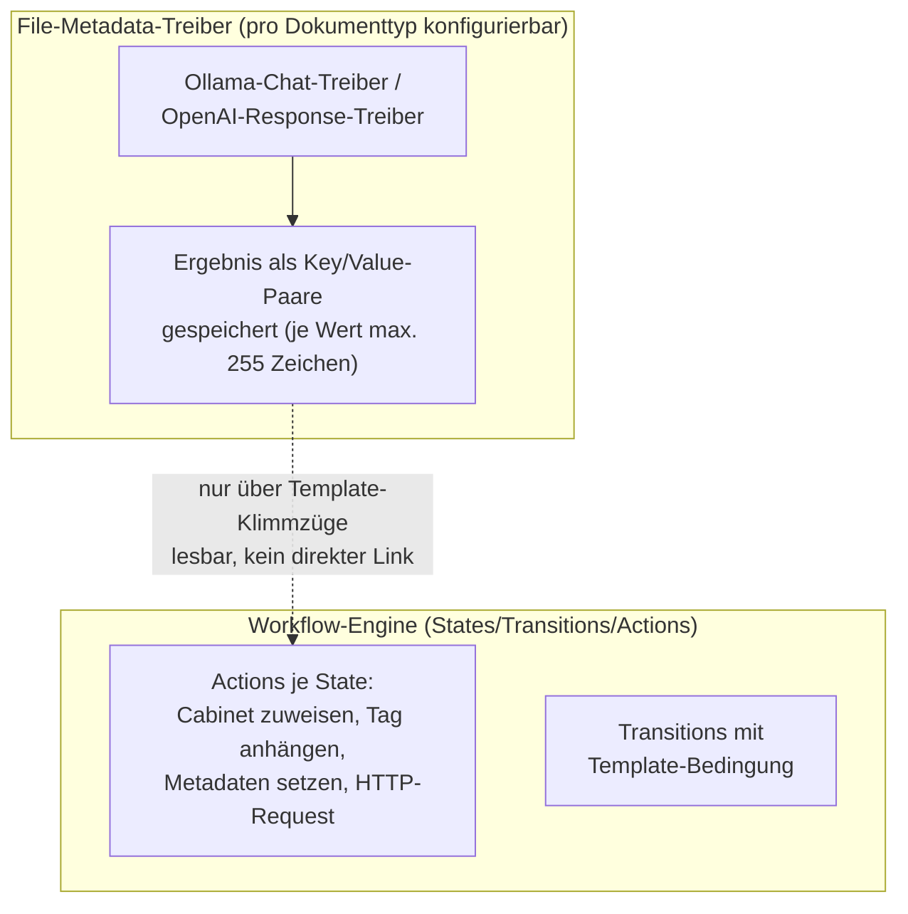

# Machbarkeit: Ollama-Klassifizierung nativ in Mayan abbilden

Ausgangsfrage: Ließe sich das, was unser externes `classify.py` tut, auch
nativ als Mayan-Workflow (ohne externes Skript) abbilden?

**Kurzfassung:** Die Bausteine sind zu einem großen Teil vorhanden und
inzwischen sogar konkreter als zunächst angenommen — es gibt einen
**echten, nativen Ollama-Treiber**. Er löst aber ein anderes Problem
(automatische Datei-Metadaten-Extraktion) als unsere Cabinet-Klassifizierung,
und hat eine harte technische Einschränkung (255-Zeichen-Werte), die eine
1:1-Übernahme unserer heutigen Logik verhindert.

## Praxistest

Der Ollama-Treiber wurde probeweise für einen einzelnen, wenig genutzten
Dokumenttyp aktiviert und an einem einzelnen bestehenden Dokument über den
manuellen "Submit"-Endpunkt ausgelöst (kein Massen-Reprocessing des
Archivs — Verarbeitung läuft nur bei neuem Datei-Upload oder gezieltem
manuellen Trigger für ein einzelnes Dokument). Ergebnis:

- **Erster Versuch mit `timeout: 60` schlug fehl** ("timed out") — der
  Kaltstart des Modells auf dem Ollama-Host dauerte in der Praxis
  ca. 62 Sekunden (`load_duration` in der Antwort), passend zu den ~3 Minuten
  Kaltstart-Zeit, die schon beim externen Skript beobachtet wurden. Mit
  `timeout: 240` lief es sauber durch.
- Ein einfacher, statischer Test-Prompt ("Antworte nur mit OK") kam korrekt
  als `message_content: "OK"` zurück — Grundverbindung zum Ollama-Host
  funktioniert.
- Ein zweiter Test mit **echtem OCR-Text des Dokuments im Prompt**
  (`{{ document_file.document.version_active.pages_first.ocr_content.content }}`)
  hat funktioniert: Das Modell hat den Dokumentinhalt korrekt in einem Satz
  auf Deutsch zusammengefasst. Die Template-Einbindung von Dokumentinhalten
  in den Prompt ist damit nicht nur theoretisch im Code vorhanden, sondern
  in der Praxis bestätigt.
- Die Zusammenfassung selbst lag mit rund 240 Zeichen knapp unter dem
  255-Zeichen-Limit — bei einer Bitte um eine kurze Zusammenfassung passt es
  gerade noch, bei unserer mehrteiligen JSON-Antwort (Cabinet, zwei
  Confidence-Werte, Korrespondent, Tags, Begründung) wäre das Limit sicher
  gesprengt worden.
- Nach dem Test wurde die Konfiguration wieder deaktiviert (bewusst kein
  Dauerbetrieb ohne expliziten Beschluss dazu).

**Fazit aus dem Praxistest:** Der Treiber funktioniert wie im Code
beschrieben und ist für kurze, einzelne Extraktionsaufgaben (z. B. eine
Ein-Satz-Zusammenfassung als zusätzliches, durchsuchbares Metadatum) real
einsetzbar — bestätigt die vorige Einschätzung.

## Zwei verschiedene Mechanismen

Mayan hat zwei unterschiedliche Bausteine, die beide für "KI + Dokument"
relevant sind, aber unterschiedliche Zwecke haben:

Die ursprüngliche Analyse ging von der Workflow-Engine aus (Abschnitt weiter
unten). Der tatsächlich existierende KI-Baustein sitzt aber in der
**File-Metadata-Extraktion**, einem eigenen, älteren Subsystem, das seit
Version 4.10 zwei neue Treiber bekommen hat.

## Was im Treiber-Code konkret verifiziert wurde

Zugriff auf den Quellcode der tatsächlich laufenden Version (nicht nur
Doku/Marketing-Text) zeigt:

- Ein **`FileMetadataDriverOllamaChat`**-Treiber existiert und ist Teil der
  Standardinstallation. Konfiguration je Dokumenttyp über vier Argumente:
  `host`, `model`, `messages` (Chat-Prompt als YAML-Liste), `timeout`.
  Intern wird schlicht `ollama.Client(host=...).chat(model=..., messages=...)`
  aufgerufen — das offizielle Ollama-Python-Paket ist bereits Teil der
  Installation.
- Ein analoger **OpenAI-Response-API-Treiber** existiert ebenfalls, inkl.
  konfigurierbarer `base_url` (explizit dokumentiert für "compatible
  non-default endpoints/proxies" — ein Ansatzpunkt, um ihn ggf. auf einen
  Ollama-Host mit OpenAI-kompatiblem Endpunkt umzubiegen, falls man nicht den
  dedizierten Ollama-Treiber nutzen möchte).
- **Alle Argumente werden pro Dokument als Django-Template gerendert**, mit
  dem jeweiligen Dokument-Datei-Objekt im Kontext (`{{ document_file }}`).
  Das heißt: der Prompt (`messages`) kann tatsächlich dynamisch pro Dokument
  befüllt werden — keine starre, für alle Dokumente gleiche Anfrage.
- **Beide Treiber sind standardmäßig deaktiviert** (`enabled = False`) —
  kein Risiko ungewollter automatischer API-Aufrufe/Kosten nach einem
  Upgrade, ohne dass man sie aktiv einschaltet.
- Das Ergebnis wird als flache Liste von Key/Value-Paaren gespeichert (z. B.
  `message.content`, `done`, `total_duration` — die komplette,
  "flachgeklopfte" API-Antwortstruktur). **Der Wert ist auf 255 Zeichen pro
  Feld begrenzt.**

## Die entscheidende Lücke

Zwei Probleme verhindern eine einfache 1:1-Übernahme unserer heutigen Logik:

1. **255-Zeichen-Limit pro Wert.** Unsere heutige Ollama-Antwort ist ein
   JSON-Objekt mit mehreren Feldern (Cabinet, zwei Confidence-Werte,
   Korrespondent, bis zu 5 Tags, Dokumenttyp, Belegdatum, Begründung) — das
   sprengt 255 Zeichen üblicherweise deutlich. Der native Treiber würde die
   Modellantwort im Feld `message.content` schlicht abschneiden.
2. **Keine direkte Brücke zur Workflow-Engine.** Die Actions der
   Workflow-Engine (Cabinet zuweisen, Tag anhängen, Metadaten setzen) lesen
   diese File-Metadata-Werte nicht automatisch mit. Ein Zugriff wäre nur über
   eine ``-Schleife über die Rohdaten in einem Template-Feld einer
   Action denkbar (Django-Templates unterstützen keinen direkten
   Schlüssel-Zugriff wie `entries['message.content']`) — und selbst dann
   bräuchte man einen JSON-Parser innerhalb des Templates, um aus dem
   (ohnehin abgeschnittenen) String wieder Cabinet/Confidence/Tags einzeln
   herauszulösen. Dafür ist in den eingesehenen Kernmodulen kein
   eingebautes Werkzeug vorhanden.

Beides zusammen bedeutet: der native Treiber eignet sich gut für einfache,
kurze Extraktionen (z. B. "gib mir das Belegdatum" oder "fasse in einem
Satz zusammen"), aber nicht ohne Weiteres für unsere mehrteilige,
JSON-Schema-constrained Klassifikationsantwort mit anschließender
Cabinet-Entscheidung.

## Ursprüngliche Analyse: Workflow-Engine-Bausteine (weiterhin relevant)

Unabhängig vom File-Metadata-Treiber bietet die Workflow-Engine selbst
brauchbare Bausteine, die für eine native Umsetzung nötig wären:

- Eine generische **"Perform an HTTP request"-Action** kann einen beliebigen
  externen Endpunkt aufrufen (URL/Payload/Headers/Methode sind
  Template-gerendert) — sie verwirft aber die Antwort, verarbeitet sie
  nicht weiter.
- Fertige Actions für **Cabinet zuweisen**, **Tag anhängen**, **Metadaten
  setzen** existieren.
- Transitions können eine **Template-Bedingung** haben — bedingte
  Verzweigung (z. B. nach Confidence-Schwelle) ist technisch möglich.
- Workflow-Instanzen haben einen **persistenten JSON-Kontext**, der über
  `extra_data` bei einer Transition befüllt und in späteren
  Templates/Bedingungen wieder gelesen werden kann.

Diese Bausteine würden erst durch eine **eigene Action-Klasse** (eigener
Python-Code als Mayan-Plugin, der die Ollama-Antwort parst und strukturiert
in den Workflow-Kontext schreibt) zu einer vollständigen, robusten Lösung.
Das ist machbar, aber dann wieder eigener Code — ähnlich viel Aufwand wie
das heutige externe Skript, nur als Mayan-Plugin statt als systemd-Service.

## Was auch mit funktionierender AI-Anbindung nicht sauber nativ abbildbar wäre

Unsere Dublettenschutz-Logik durchsucht bei jedem Dokument den **gesamten
bestehenden Cabinet-Baum** nach einem passenden Korrespondenten-Blatt, bevor
neu angelegt wird, und hält eine Batch-lokale Liste konsistent. Das ist eine
dynamische Suche über eine wachsende Struktur — dafür gibt es keinen
generischen Workflow-Action-Typ.

## Fazit

- Ein nativer Ollama-Treiber existiert real und ist gut für **einfache**
  Extraktionsaufgaben pro Dokument geeignet (kurze, einzelne Werte).
- Für unsere **mehrstufige, JSON-Schema-constrained Klassifikation mit
  Confidence-Gates und Cabinet-Dublettenschutz** reicht er nicht aus — das
  255-Zeichen-Limit und die fehlende Brücke zur Workflow-Engine sind harte
  Grenzen, keine Konfigurationsfrage.
- Eine native Vollumsetzung wäre nur mit eigenem Plugin-Code möglich und
  brächte gegenüber dem heutigen externen Skript keinen klaren Vorteil.
- **Empfehlung bleibt: beim externen Skript bleiben.** Der native Treiber
  ist aber ein guter Kandidat für kleinere Zusatzaufgaben (z. B. eine kurze
  automatische Ein-Satz-Zusammenfassung als Datei-Metadatum), die nicht an
  unserer Cabinet-Logik hängen.
